<div align="center">

# QuickMate

### Manufacturing ERP that thinks ahead — not just records data.

**Sales → Inventory → Make vs Buy → Production → Delivery — in one intelligent flow.**

[](https://nodejs.org/)
[](https://nextjs.org/)
[](https://www.prisma.io/)
[](https://www.typescriptlang.org/)

[Live Demo](#-quick-start) · [Features](#-features) · [Screenshots](#-screenshots) · [Architecture](#-architecture) · [Testing](#-testing)

</div>

---

## Overview

**QuickMate** is a manufacturing-focused ERP built for furniture and make-to-order businesses. Unlike traditional ERPs that scatter order status across dozens of screens, QuickMate centers everything around **one question**:

> *Where is my order right now — and what happens next?*

The platform combines a full operational stack (sales, procurement, manufacturing, inventory) with an **AI-powered intelligence layer** that surfaces risks, bottlenecks, and recommendations before they become crises.

Built for **Shiv Furniture Works** as a hackathon-grade ERP prototype with production-quality architecture.

---

## Screenshots

### Control Tower — Business health at a glance

Real-time health scores across inventory, manufacturing, and procurement with AI recommendations.

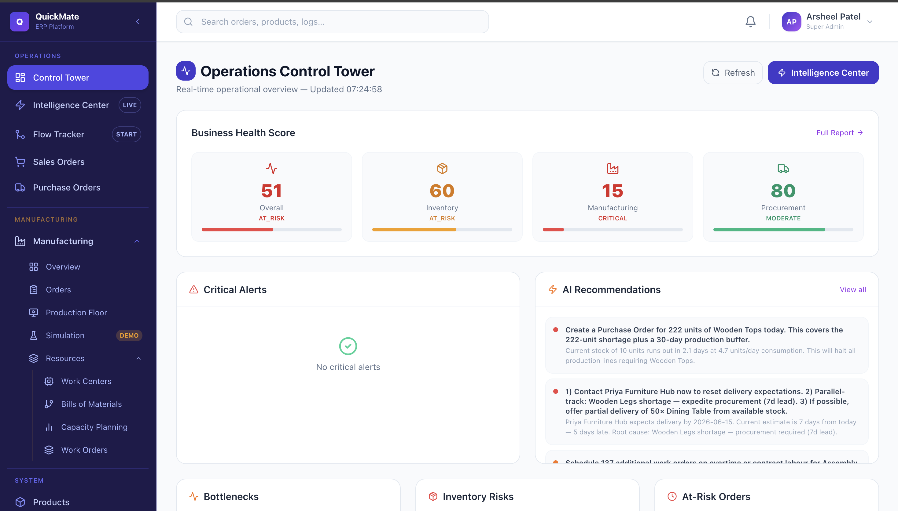

---

### Operations Intelligence Center

Live risk dashboard: inventory shortages, order delays, work-center overload, and procurement forecasts.

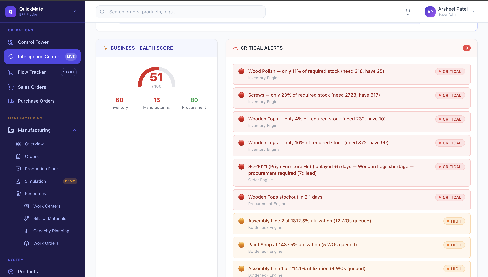

---

### Flow Tracker — The order command center

Track every order from confirmation through inventory check, make-vs-buy routing, production, and delivery — with actionable buttons at each step.

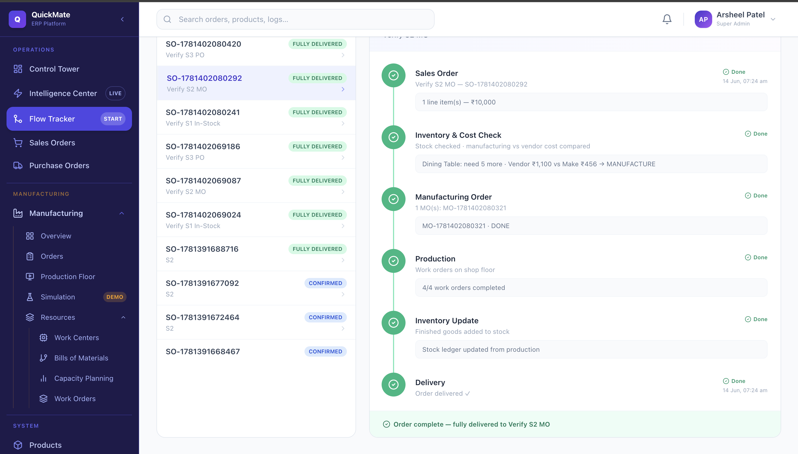

---

### Sales Orders — Kanban pipeline

Visual pipeline from Draft → Confirmed → Production → Completed with one-click confirm and Flow Tracker links.

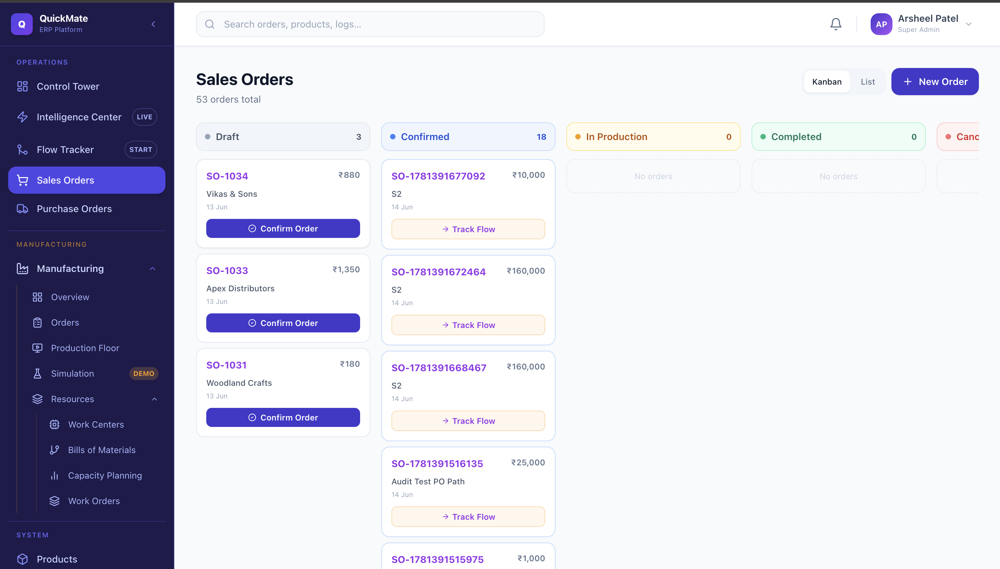

---

### Purchase Orders

Full procurement lifecycle: RFQ → PO → Confirm → Receive → inventory update.

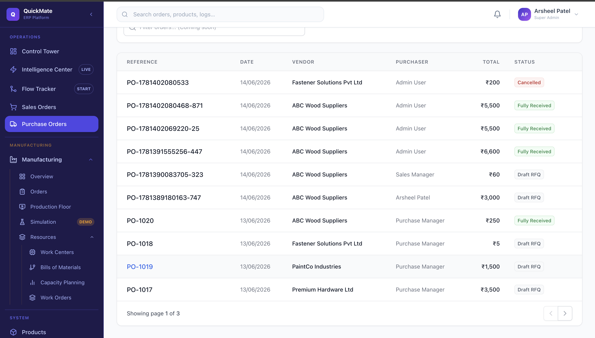

---

### Manufacturing Overview

Work-center utilization, bottleneck detection, and open MO tracking for the shop floor.

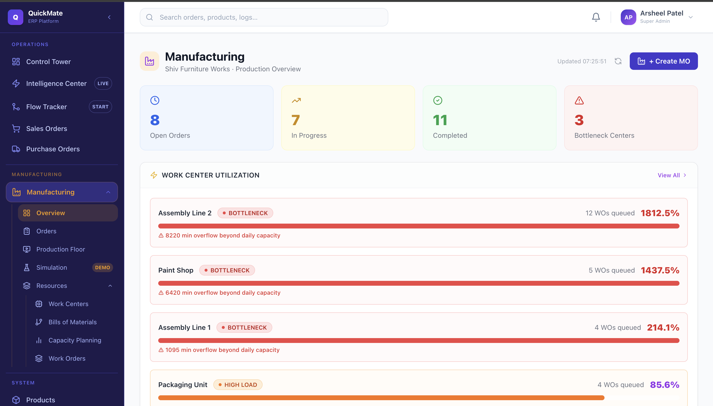

---

### Manufacturing Orders

MO list linked to source sales orders with progress bars and status filters.

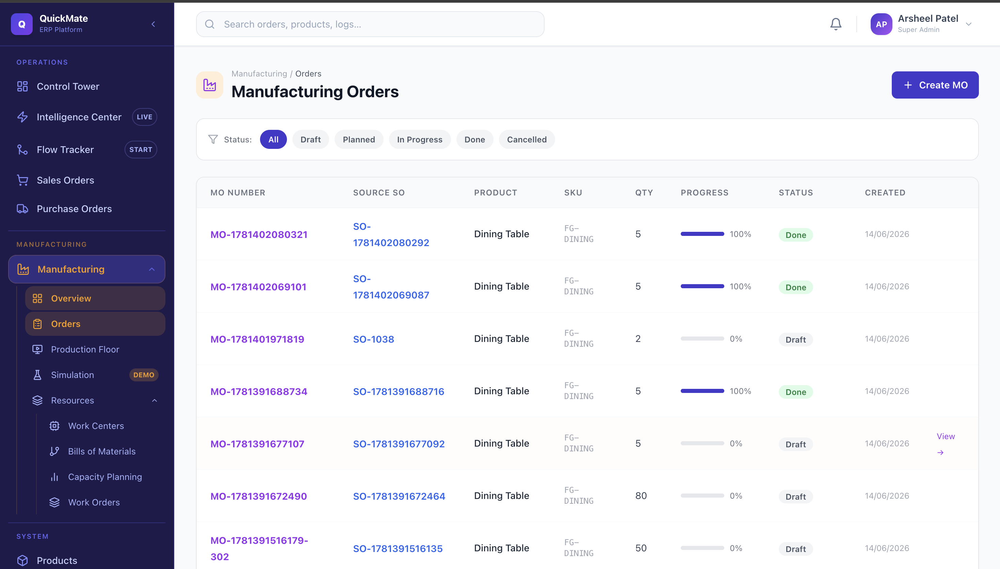

---

### Production Floor

Shop-floor view — start, pause, and complete work orders with real-time status cards.

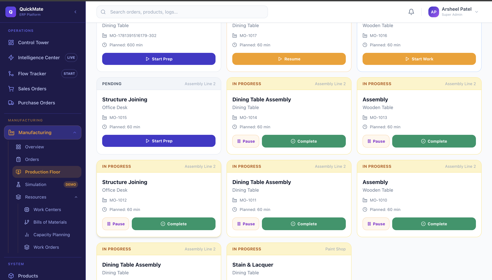

---

### Production Simulation

What-if analysis: BOM expansion, material gaps, procurement cost, and delay estimation for any order quantity.

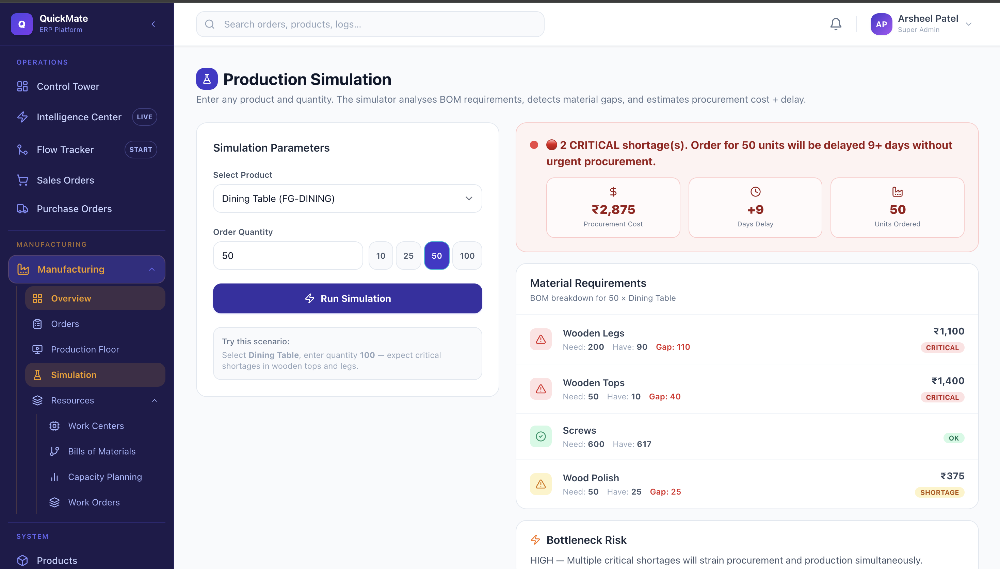

---

### Work Centers & Capacity

Bottleneck visualization with utilization %, queue depth, and AI redistribution recommendations.

<p float="left">
  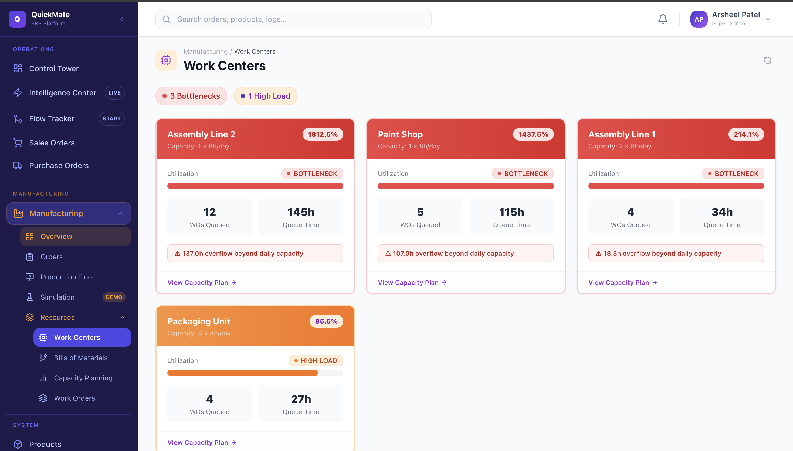
  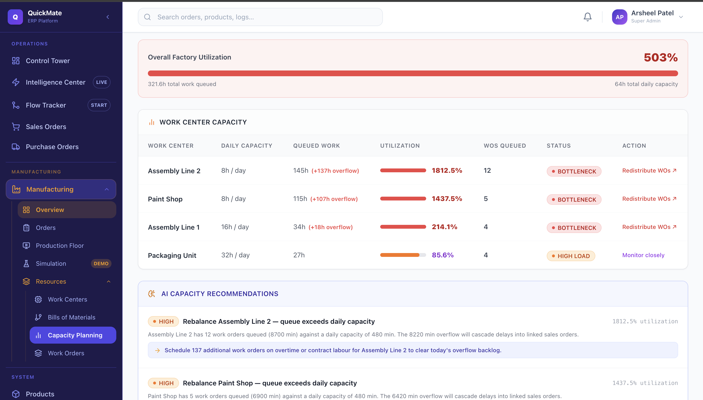
</p>

---

### Bills of Materials

Multi-level BOM editor with components and routing operations.

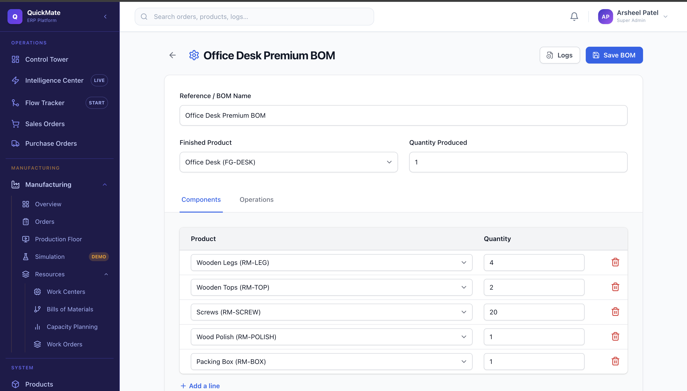

---

### Work Orders, Products & User Management

<p float="left">
  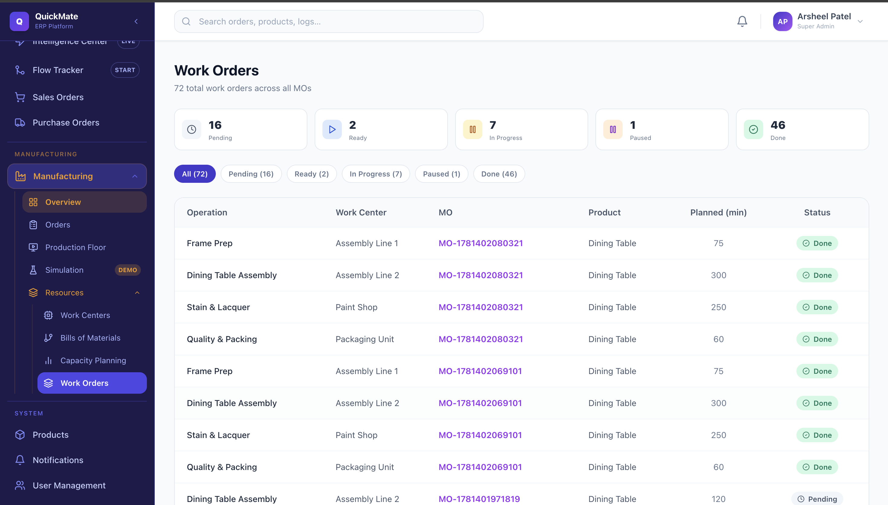
  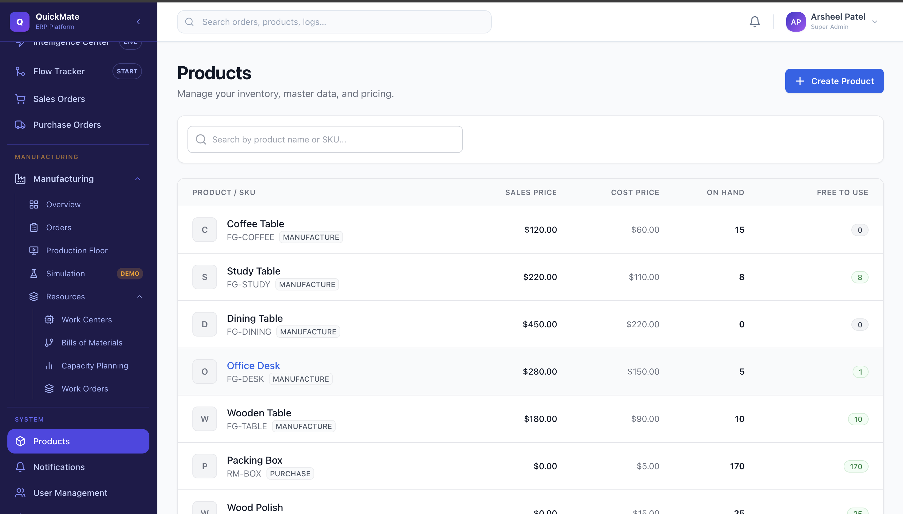
  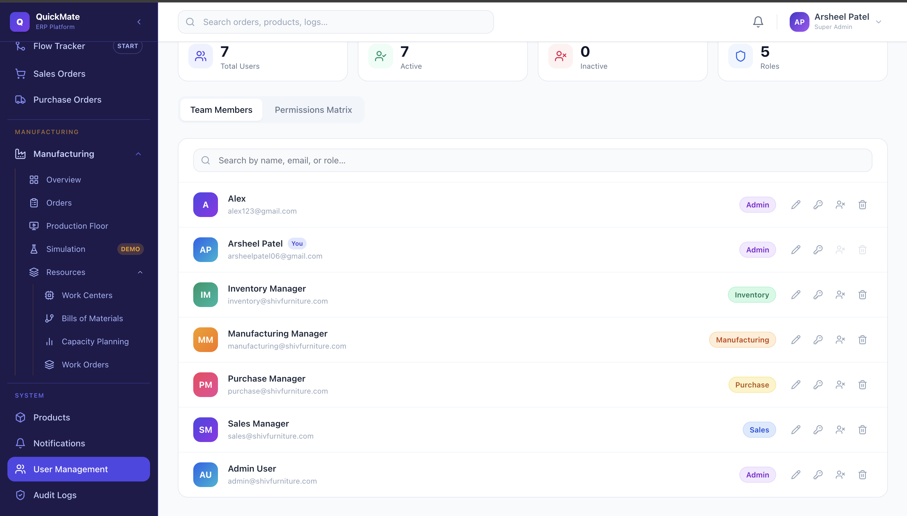
</p>

---

## Features

| Module | Capabilities |
|--------|-------------|
| **Flow Tracker** | End-to-end order timeline, make-vs-buy cost comparison, MO/PO creation, PO receive, delivery gating |
| **Intelligence Center** | Inventory risk, procurement forecast, bottleneck analysis, order risk scoring, AI advisor |
| **Sales** | Order creation, confirmation, stock reservation, kanban pipeline |
| **Procurement** | RFQ, PO confirm, goods receipt, stock ledger update, cancel |
| **Manufacturing** | MO creation from BOM, work orders, production floor, MO completion → stock |
| **Simulation** | BOM explosion, shortage detection, cost & delay estimation |
| **Inventory** | On-hand, reserved, free-to-use qty, stock ledger audit trail |
| **System** | RBAC (5 roles), user management, notifications, audit logs, Firebase auth |

---

## Order Lifecycle

```
Sales Order (DRAFT)
    │
    ▼ Confirm ──► Inventory check + stock reservation
    │
    ├── In stock ──────────────────────────► Deliver
    │
    └── Shortage ──► Make vs Buy comparison
              │
              ├── Manufacturing cheaper ──► MO ──► Work Orders ──► Production Floor ──► Stock IN ──► Deliver
              │
              └── Vendor cheaper ──► PO ──► Confirm ──► Receive ──► Stock IN ──► Deliver
```

Every step is actionable from **Flow Tracker** — the golden path for demos and daily operations.

---

## Architecture

```
┌─────────────────────────────────────────────────────────┐
│  Frontend — Next.js 14 · React 18 · TypeScript · Tailwind│
│  Port 3001                                               │
└──────────────────────────┬──────────────────────────────┘
                           │ REST API
┌──────────────────────────▼──────────────────────────────┐
│  Backend — Node.js · Express · Prisma                    │
│  Port 4000                                               │
├──────────────────────────────────────────────────────────┤
│  Services: flow · sales · procurement · manufacturing    │
│            stock · automation · intelligence · audit    │
└──────────────────────────┬──────────────────────────────┘
                           │
┌──────────────────────────▼──────────────────────────────┐
│  PostgreSQL (Prisma ORM)                                 │
└──────────────────────────────────────────────────────────┘
```

**Auth:** Firebase Authentication + JWT fallback for seeded demo users  
**Intelligence:** Rule-based engines + advisor service (inventory, bottleneck, order risk, procurement forecast)

---

## Tech Stack

| Layer | Technology |
|-------|-----------|
| Frontend | Next.js 14, React 18, TypeScript, Tailwind CSS, Recharts, Lucide |
| Backend | Node.js, Express, Joi validation |
| Database | PostgreSQL, Prisma ORM |
| Auth | Firebase Admin SDK, JWT |
| Email | Nodemailer (SMTP) |

---

## Quick Start

### Prerequisites

- Node.js 18+
- PostgreSQL running locally
- `.env` configured (see `.env.example`)

### 1. Install & seed

```bash
# Backend
npm install
npx prisma migrate dev
npm run seed

# Frontend
cd frontend && npm install
```

### 2. Run

```bash
# Terminal 1 — Backend (port 4000)
npm run dev

# Terminal 2 — Frontend (port 3001)
cd frontend && npm run dev
```

### 3. Open

**http://localhost:3001**

### Demo credentials

| Email | Password | Role |
|-------|----------|------|
| admin@shivfurniture.com | password123 | ADMIN |
| sales@shivfurniture.com | password123 | SALES |
| purchase@shivfurniture.com | password123 | PURCHASE |
| manufacturing@shivfurniture.com | password123 | MANUFACTURING |
| inventory@shivfurniture.com | password123 | INVENTORY |

---

## Testing

Run the full automated verification (auth, APIs, 3 E2E scenarios):

```bash
npm run verify
```

Expected: **17/17 checks pass**.

See [TESTING.md](TESTING.md) for manual UI checklist and judge demo script.

---

## Project Structure

```
QuickMate/
├── frontend/           # Next.js app (port 3001)
│   ├── app/            # Pages (App Router)
│   └── components/     # Layout, UI components
├── src/                # Express backend (port 4000)
│   ├── controllers/
│   ├── services/       # Business logic incl. flowService
│   ├── intelligence/   # Risk & advisor engines
│   └── routes/
├── prisma/             # Schema + seed data
├── scripts/            # verify-e2e.js
├── docs/screenshots/   # README images
└── TESTING.md
```

---

## Demo Script (3 minutes)

| Step | Screen | What to say |
|------|--------|-------------|
| 1 | Operations Intelligence | "Here are today's business risks." |
| 2 | Flow Tracker | "Let's walk this order from confirm to delivery." |
| 3 | Production Floor | "Here's where work actually happens." |
| 4 | Simulation | "What if we get a 50-unit order tomorrow?" |

---

## Documentation

| Document | Description |
|----------|-------------|
| [TESTING.md](TESTING.md) | Automated verify script + manual demo checklist |

---

## Author

**Arsheel Patel** — [GitHub](https://github.com/ArsheelPatel06)

---

<div align="center">

Built for manufacturing teams who need clarity, not clutter.

**QuickMate** — *Your order. One screen. Full story.*

</div>
